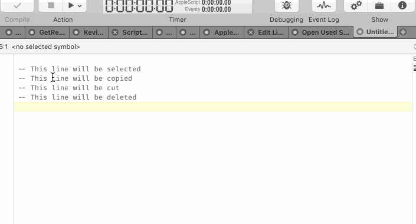
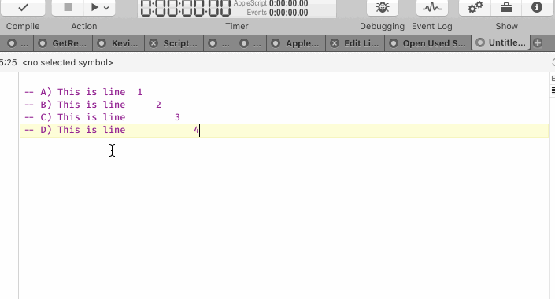
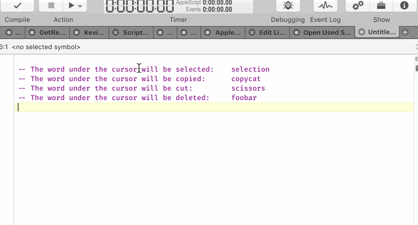
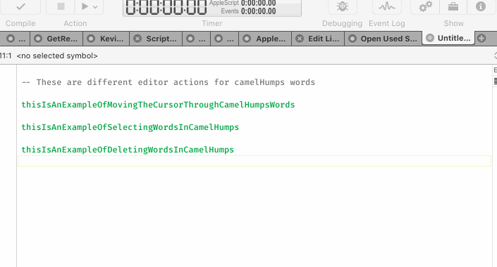

# Extra Editor Actions for Script Debugger

- This library provides several useful editor functions for ScriptDebugger

- Line Actions:
	1. Select Line
	2. Copy Line
	3. Cut Line
	4. Delete Line
	
	
	
	
	5. Move Line Up
	6. Move Line Down
	
	

- Word Actions:
	1. Select Word Under Cursor
	2. Copy Word Under Cursor
	3. Cut Word Under Cursor
	4. Delete Word Under Cursor

	
	
	
- camelHumps Word Actions
	1. Move Cursor Through camelHumps words
	2. Select Words in camelHumps words
	3. Delete Words in camelHumps words
	
	

- Personally I use Keyboard Maestro to execute these scripts as in the example below.

Installation
------------
Download the zip file and extract the Script Debugger Library.scptd to ~/Library/Script Libraries
and that's it!
